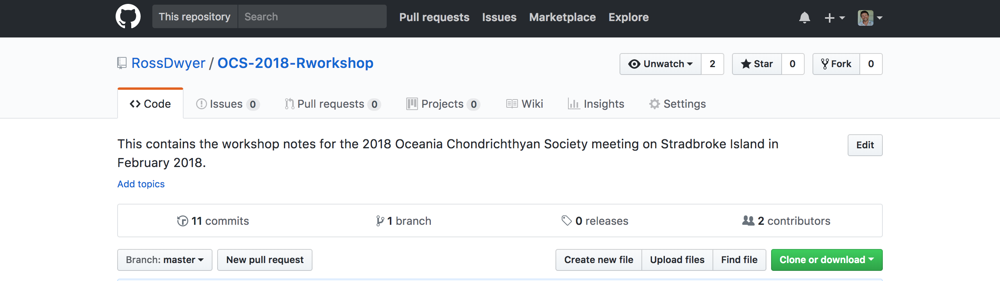

--------------------------------------

<br>  
<br>  

```{r, out.width = 1000, fig.retina = NULL, echo=FALSE}
knitr::include_graphics("Images/Cassowary track.png")
```

--------------------------------------

#Introductions

##Who are we?
Ross is a spatial ecologist interested in the drivers of movement, space use and community structure in free-ranging animals. He's used R for over 12 years, has published two R packages on CRAN, was lead R developer on the ZoaTrack.org project and regularly teaches R training courses at The University of Queensland and at other institutes around Australia. For more information and teaching resources, check out [Ross's website](https://www.uq.edu.au/eco-lab/content/dr-ross-dwyer).

Vinay is...

##Course outline

**In this course you will learn how to analyse and interpret your aquatic telemetry datasets in R**. This workshop will hopefully show you how **R** can make the processing of spatial data much quicker and easier than using standard GIS software, and can help you plot some *deadly* figures! At the end of this workshop you will also have the annotated **R** code that you can re-run at any time, share with collaborators and build on with those newly acquired data!

We designed this course not to comprehensively cover all the tools in **R**, but rather to teach you skills for taking your experience with R to the next level. Every new project comes with its own problems and questions and you will need to be independent, patient and creative to solve these challenges. It makes sense to invest time in becoming familiar with **R**, because today **R** is the leading platform for environmental data analysis and has some other functionalities which may surprise you! 

This R workshop will be divided into 4 sessions intended to run about 1 hr 15 mins each.

* Session 1: 

0.  Introduction to **R**
1.  **import** large data files using **data.table**
2.  **filter** our data using %pipes% the [tidyverse](http://tidyverse.org/) group of **R** packages
3.  advanced plotting using [ggplot2](http://ggplot2.org/) and [Rcolorbrewer](http://rcolourbrewer.org/)

* Session 2:

4.  Working with **spatial objects**
5.  Shapefile export and import 
6.  Producing track animations 
7.  Integration with [Google Earth](http://googleearth.com/) 
8.  Generating interactive maps using [leaflet](http://leafletjs.com/) 


* Session 3:

9.  Calculating and plotting **home range** area metrics using
a)  MCPs (array/matrix)
b)  Linear home ranges
c)  Brownian bridges
10. Calculating distance metrics (direct, circuitous, least cost)
11. Plotting distance through time


**The main principles we hope you will learn today are...**

1. Data wrangling in **R** is safe, fast, reliable and repeatable
2. **R** can easily handle large datasets
3. **R** is the ideal suite for performing your GIS operations
4. that in **R**, it is easy to produce amazing publication-ready images 

---------------------------------------

# Session 1: Working with large tracking datasets


##The Challenge

The process of turning raw telemetry data into publishable results is a highly involved process. Ecological data sets are becoming larger and larger as they are  gathered over longer time periods, over larger spatial extents and at increasing temporal resolutions. While this is increasing our ability to detect subtle patterns, these data sets are becoming so vast that they come with additional challenges.

For example, our analysis may require us to filter these large data sets and integrate with other data types that we have gathered ourselves, acquired from our collaborators or downloaded from online repositories. These data may have different header rows, the values may be in the wrong format/structure or likely cover different spatial or temporal scales. The spatial and temporal component of the data may also be important, requiring us to apply specialised analytical techniques and GIS operations. Finally, multiple software platforms may be needed to process the data, run the analyses and generate results. 

This process can require a huge personal investment in time: rearranging data, removing erroneous values, purchasing, downloading and learning the new software, and running analyses. Furthermore merging together excel spreadsheets, filtering data and preparing data for statistical analyses and plotting in different software packages can introduce all sorts of errors. 

*There is a better way...*

---------------------------------------

##Why use **R**

**R** is a powerful language for data wrangling and analysis because...

1. It is relatively **fast** to run commands
2. You can create **repeatable** scripts
3. You can **trace errors** back to their source
4. You can **share your scripts** with other people
5. It is **easy to identify errors** in large data sets
6. Having your data in **R** opens up a huge array of **cutting edge analysis tools**.
7. **R** is also totally **FREE!** 

As **R** is open source, the more people we can get helping out on the **R** spatial mailing lists (e.g. **R-sig-geo**) and contributing their own spatial packages to the wider community, the more powerful **R** becomes!

---------------------------------------

##Obtaining **R**

If you do not currently have **R** installed on your machine, **R** can be downloaded from <http://cran.r-project.org/>
Using a script editor, such as **R Studio**, can make the writing and editing of code much more enjoyable and far less of a head-ache. 
If you do not currently have **R Studio** installed on your machine, it can be downloaded from <http://www.rstudio.com/>. 

It is worth updating these software on a regular basis as some of the most powerful new tools are only available on the latest release.

---------------------------------------


##Working with projects

THere are a number of good reasons why you should work with projects in RStudio.
1.  We may want our R scripts to be saved into a place where they link seamlessly to other documents and data files for our research project.
2.  We may also want our tables, figures and statistical results to be written to locations on our computer where they are easy to locate.
3.  We may work on multiple workstations (desktops, laptops) that we want our code to be completely transferable using cloud infrastructure (e.g. [Dropbox]<http://www.dropbox.com/>, [OneDrive]<http://www.onedrive.com/>)
3.  It allows it to shark work folders, data and R code with collaborators who are working on the same projects

"

The folder **OCS-2018-Rworkshop** downloaded from [GitHub]<https://github.com/RossDwyer/OCS-2018-Rworkshop>  contains the course documents, telemetry data and GIS files we are going to be working with. This is organised in the same format that we organise all our project files, and we have found it completely transferable across all the projects  we are involved with. The main project folder contains the following sub folders:

1.  Documents
2.  Data
3.  R Code
4.  GIS

First unzip this folder and extract the folder to a location on your computer that you typically store your research files. 

To link with these folders, we are going to use the `Project` functionality of R Studio.

In R Studio, click *File > New Project*.

To create a new project use the *Create Project* command (available on the Projects menu and on the global toolbar):

"

Select *Existing Directory* then save the project within the "JCU telemetry workshop" folder. 

When a *New Project* is created, R Studio:

1.  Creates a project file (with an **.Rproj** extension) within the project directory. This file contains various project options (discussed below) and can also be used as a shortcut for opening the project directly from the file system.
2.  Creates a hidden directory (named **.Rproj.user**) where project-specific temporary files (e.g. auto-saved source documents, window-state, etc.) are stored. 
3.  Loads the project into R Studio and display its name in the Projects toolbar (which is located on the far right side of the main toolbar (very TOP RIGHT of the R Studio window).

Working with Projects is a good idea because it saves the address that files are located and makes you coding much more elegant. It also allows you to share your script easily and seamlessly with collaborators.

---------------------------------------


##Installing packages

Part of the reason R has become so popular is the vast array of packages that are freely available and highly accessible. In the last few years, the number of packages has grown exponentially - 8000 at my last check on CRAN! These can help you to do a galaxy of different things in R, including running complex analyses, drawing beautiful figures, running R as a GIS, constructing your own R packages, building web pages and even writing introductory R course handbooks!

Let’s suppose you want to load the *sp* package to access this package's incredible spatial functionality.

If this package is not already installed on your machine, you can download it from the web by using the following command in R.

```
install.packages("sp", repos='http://cran.us.r-project.org')
```

In this example, `sp` is the package to be downloaded and 'http://cran.us.r-project.org' is the repository where the package will be accessed from

Multiple packages can be loaded at the same time by listing the required packages in a vector 

```
install.packages(c("sp","rgdal","rgeos","adehabitatLT","adehabitatHR"), repos='http://cran.us.r-project.org')
```

We then load the required packages from our computer's R package library using the `library()` function.

```{r, echo=FALSE}
library(sp)
library(rgdal)
library(rgeos)
library(adehabitatLT)
library(adehabitatHR)
library(VTrack)
```


------------------------------------------


##  Importing large data files using **data.table**

In the first session we are going to work with a data set containing locations from X estuarine crocodiles (*Crocodylus porosus*). These were all large animals (X m Total length) captured and tagged with assistance of Australia Zoo and funding from the Australian Research Council Linkage scheme. Crocodiles were tracked for between X and X months usong a network of acoustic hydrophones deployed along a river system.


```{r, echo=FALSE,message=FALSE,include=TRUE}

library(leaflet)
library(htmlwidgets)
library(rgdal)
library(sp) 
library(rgeos)
library(RColorBrewer)
library(knitr)

## Import cleansed 2014 tagged animal file from ZoaTrack
cassdat <- read.csv('Data/zoatrack-data.csv', header = TRUE)
cassdat$DATE <- as.character(as.POSIXct(cassdat$DATE,format="%Y-%m-%d %H:%M:%S"))
sANIMALID <- levels(cassdat$ANIMALID)

pal <- colorFactor(c("red","blue","green"), 
                   domain = as.character(sANIMALID))
cassdat$ANIMALCOL <- ifelse(cassdat$ANIMALID==sANIMALID[1],"red",
                            ifelse(cassdat$ANIMALID==sANIMALID[2],"green","blue"))

cassdat.sp <- cassdat
coordinates(cassdat.sp) <- ~LONGITUDE+LATITUDE

leaflet(cassdat.sp) %>%
  
  #Base groups
  addTiles(group = "OSM (default)") %>%  # Add default OpenStreetMap map tiles
  addProviderTiles("Esri.WorldImagery") %>%
  
  #Overlay groups
  # All Data
  addCircleMarkers(popup=paste("DATE=",cassdat.sp$DATE,"DELETED=",cassdat.sp$DELETED,sep=(" ")),
                   weight=2,
                   radius=5,
                   color = cassdat.sp$ANIMALCOL,
                   stroke = FALSE, fillOpacity = 0.4, group = "Points") %>%

  # Layers control
  addLayersControl(
    baseGroups = c("OSM (default)","Esri.WorldImagery"),
    overlayGroups = c("Points"),
    options = layersControlOptions(collapsed = FALSE)) %>% 
  
  #Legend
  addLegend("topright",
            colors=c("red","green","blue"), 
            labels=as.character(sANIMALID),
            labFormat = labelFormat(prefix = "$"),
            opacity = 1)

```
The web map of hydrophone locations that we will make at the end of **Session 1**


------------------------------------------

##Reading large telemetry data sets into **R**

We load a file into **R**, by telling it which file to load (`croc-data.csv`) and where to find it (i.e. in the `Data` folder).

```{r}
# Load the crocodile data
crocdat <- read.data('Data/croc-data.csv', header = TRUE) ## Vinay to add data.table functionality
```

The data.table package is new functionality within **R** and is very effective at loading in very large files, such as those exported from the [Vemco VUE database]

**A note about Excel files**  

Don’t use '.xlsx' or '.xls' files for saving data. The problem with '.xls' and '.xlsx' files are that they store extra info with the data that makes files larger than necessary and Excel formats can also unwittingly alter your data! 

A stable way to save your data is as a '.csv' file, which stands for 'comma separated values'. These are simply values separated by 'commas' and rows defined by 'returns'. If you select 'Save as’ in excel, you can choose '.csv' as one of the options. If you open the .csv file I have given you using a text editor, you will see it is just words, numbers and commas.


##Accessing variables in the data frame
The rules we learned above for accessing values of an object also apply to data frames. A data frame is a special ‘class’ of an object, where there are multiple variables, stored in names columns and multiple rows for our samples. Every variable has the same number of samples. A key difference from the objects we created earlier is that now we have both rows and columns. Rows and columns are indexed by using a comma as a separator. Try the following code:

```{r,eval=FALSE}
cassdat[1,] # Provides the first row of data
cassdat[1,3] # Provides the cell value from the 1st row and 3rd column
cassdat[,3]  # Provides the first column of data
cassdat[c(1,3),] # Provides the first and third date in the data frame
```

We can also access objects in a data frame by their names:

```{r,eval=FALSE}
cassdat$DATE #provides all the data for that object
cassdat$DATE[1:5] #provides athe first five values for that object
cassdat[,'DELETED'] #provides all the data for that object
```


Now that we've successfully loaded in our tracking dataset, lets start having a closer look at the data using pipes `%>%`

* Originally from the `magrittr` package but has been imported to the `tidyverse`.
* `%>%` is an **infix operator**. This means it takes two operands, left and right.
* 'Pipes' the **output** of the last expression/function (left) forward to the **first input** of the next funciton (right).

```{r, eval = FALSE}
#For example, to see what class our data is in, we could use this code...
class(cassdat)

#Alternatively in the tidy verse we could use this code...
cassdat %>% class()
```

### Benefits of pipes %>% 
* Functions flow in natural order that tells story about data.
* Code effects are easy to reason about by inserting `View()` or `head()` into pipe chain.
* Common style makes it easy to understand collaborator (or your own) code.

We can get have a quick look at the data frame by typing:

```{r}
# Now insert functions into the pipe chain
cassdat.df %>% View()
cassdat.df %>% head() #first 6 rows by default
cassdat.df %>% tail(10) #specify we want to look at the last 10 rows
```

This functionality is particularly useful if the data frame is very large!

Note the `()` around the data frame, as opposed to the `[]` we used for indexing. The `()` signify a *function*.

We can look at the data more closely using the `nrow`, `ncol`, `length`, `unique`, `str()` and `summary()` functions.

```{r,eval=FALSE}
cassdat.df %>% nrow() # number of rows in the data frame
cassdat.df %>% ncol() # number of columns in the data frame

cassdat.df %>% str() # provides internal structure of an R object
cassdat.df %>% summary() # Provides result summary of the data frame

length(cassdat$ANIMALID) # the number of values within a vector (same as the number of rows in the dataset)

unique(cassdat$ANIMALID) # We use the unique function to extract the unique values for the tags deployed


min(cassdat$DATE) # provide the date of the first detection in our database
max(cassdat$DATE) # provide the date of the last detection in our database
```


<br>  

Now that you've fully jumped into the world of pipes, it's time to fully introduce you to the *tidyverse* group of R packages. These have really revolutionised the way we work with big data and the way we visualise our results.

##The tidyverse

```{r setup, include=FALSE}
library(tidyverse)
```

###What is the tidyverse?
* The [tidyverse](http://tidyverse.org/) is the collective name given to suite of **R** packages designed mostly by Hadley Wickham.
* Before it was formalised in 2016 it was loosely referred to as the `hadleyverse`.
* Packages share a common API and design philosophy intended to create a **"Pit of Success"**.
* The documentation of this style is still evolving.
* [This is a good start](https://rpubs.com/yeedle/tidyguide)

###Members of the tidyverse
broom, **dplyr**, forcats, **ggplot2**, haven, httr, hms, jsonlite, **lubridate**, magrittr, modelr, purrr, **readr**, readxl, stringr, tibble, rvest, **tidyr**, xml2


## dplyr
* `dplyr` is the data wrangling workhorse of the tidyverse.
* Provides functions, **verbs**, that can manipulate tibbles into the shape you need for analysis.
* Has many backends allowing dplyr code to work on data stored in SQL databases and big data clusters.
    - Works via translation to SQL. Keep an eye out for the SQL flavour in `dplyr`

###Basic vocabulary
* `select()` columns from a tibble 
* `filter()` to rows matching a certain condition
* `mutate()` a tibble by changing or adding rows
* `arrange()` rows in order
* `group_by()` a variable
* `summarise()` data over a group using a function

Check out this useful [Cheatsheet](https://www.rstudio.com/wp-content/uploads/2015/02/data-wrangling-cheatsheet.pdf) for data wrangling.

###`select`

We can use the `select` function in dplyr to choose the columns we want to include for our analyses and plotting

```{r}
# Select the rows we are interested in
cassdat.df2 <- 
  cassdat.df %>% 
  select(coords.x1,coords.x2,id,date,dt,dist,abs_angle,rel_angle,R2n) %>%
  select(-R2n)

head(cassdat.df2)
```

###`filter` and `arrange`
Subset the data to rows matching logical conditions and then arrange according to particular attributes
```{r, eval=FALSE}
filter(cassdat.df2, id == "M2") %>%
  arrange(dist)

filter(cassdat.df2, id == "M2") %>%
  arrange(desc(dist)) 
```

##Working with dates and times in **R**

In the following example, we subset our data for only those locations that occurred before a particular date. To do this we will use the `enter here` function in the lubridate package to confirm the string type, and the `mutate` funtion to add this column to our existing data frame

```{r}
# Here we use functions contained inthe lubridate package to add date columns to our dataset
library(lubridate)

# Add an hour onto the time fields
cassdat.df3 <- 
  cassdat.df2 %>%
  mutate(date2 = date + (60*60*10)) # Adds a date field and then changes the data from UTM to AEST)(i.e. adds 10 hrs)

# extract hour and month using lubridate function
# attach the column using the mutate function
cassdat.df4 <- 
  cassdat.df3 %>%
  mutate(hourofday = hour(date2)) %>%
  mutate(month = month(date2))

## Now convert the duration between locations from seconds to minutes
cassdat.df5 <-  cassdat.df4 %>%
  mutate(dt_hr= (dt)/(60*60))
```

###`summarise`
Determine the total distances travelled for the total duration plus in a given month
```{r}
cassdat.df5 %>%
  group_by(id) %>%
  summarise(totaldist = sum(dist, na.rm=T))

cassdat.df5 %>%
  group_by(month, id) %>%
  summarise(monthlydist = sum(dist, na.rm=T))
```


By plotting these data, we can see which data points hace been removed

ggplot, one of the packages in the tidyverse, has a similar look...
```{r, eval = FALSE}
exampledata  %>% 
ggplot(aes(x=ntags, y=nPU)) +
  geom_point(alpha = 0.1,show_guide = F) +
  geom_jitter(width = 0.01, height = 0.01) +
  xlab("Number of tags") +
  ylab("Number of planning units") +
  theme_bw() +
  theme(legend.title=element_blank(),
        axis.line = element_line(colour = "black"),
        panel.grid.major = element_blank(),
        panel.grid.minor = element_blank(),
        panel.border = element_blank(),
        panel.background = element_blank()) +
  guides(color=guide_legend("season"), fill = guide_legend("season")) +
  geom_smooth(method="lm", formula = y~log(x), se = F, size = 1) 
```


```{r}
plot(cassdat$LONGITUDE,cassdat$LATITUDE)
points(cassdat2$LONGITUDE,cassdat2$LATITUDE,col=cassdat$ANIMALID,pch=16)
```

From the interactive map at the beginning of this exercise, you will see that the deleted locations (white circles) were obatined prior to the devices being attached to the animals (i.e. at our accomodation in Cairns and enroute to our release site!)

However, this plot is  a little misleading - the longitude and latitude fields have been distorted to fit on the x and y axes. In order to fix this, we'll need to install a few additional R packages.

------------------------------------------


----------------------------


##Working with spatial objects

R offers a variety of functions for importing, manipulating, analyzing, and exporting spatial data. Although one might at first consider this to be the exclusive domain of GIS software, using R can frequently provide a much more lightweight, yet equally effective solution that embeds within a larger analytic workflow.

One of the tricky aspects of pulling spatial data into your analytic workflow is that there are numerous complicated data formats. In fact, even within R itself, functions from different user-contributed packages often require the data to be structured in very different ways. The good news is that efforts are underway to standardize spatial data classes in R. This movement is facilitated by sp, an important base package for spatial operations in R. It provides definitions for basic spatial classes (points, lines, polygons, pixels, and grids) in an attempt to unify the way R packages represent and manage these sorts of data. It also includes some core functions for creating and manipulating these data structures. The hope is that all spatial R packages will use (or at least provide conversions to) the 'Spatial' data class and it's derivatives, as now defined in the sp package. All else being equal, we favor R functions and packages that conform to the sp standard, as these are likely to provide the greatest future utility and durability.

[Here](http://www.maths.lancs.ac.uk/~rowlings/Teaching/UseR2012/cheatsheet.html) is a very useful style giude for coding using `Spatial` objects. 

---------------------------

##`SpatialPoints` and animal locations

The most basic spatial data object is a point, which may have 2 (X, Y) or 3 components (X, Y, Z). A single coordinate, or a collection of coordinates, may be used to define a `SpatialPoints` object.

In this exercise we are going to convert our cassowary locations from a standard data frame object into a `SpatialPointsDataFrame` object.

```{r,echo=FALSE}
# First make a duplicate of points.df to retain the non-spatial version
cassdat.sp <- cassdat2

# Now convert the data.frame object into a SpatialPoints object
coordinates(cassdat.sp)<- c("LONGITUDE", "LATITUDE")

## Have a look at the created object
class(cassdat.sp)
str(cassdat.sp)
```

Notice the class has now become a `SpatialPointsDataFrame`. The `str()` output contains lots of `@` symbols which denote a different slot in this S4 R object. Typing `points.sp@data` will extract the attribute data (similar to the attribute table in ArcGIS). The X and Y locational information can now be found in the `@coords` slot. In addition `@bbox` contains the bounding box coordinates and the `@pro4string` contains the projection, or coordinate reference system (CRS) information. 

```{r, eval=FALSE}
cassdat.sp@coords
cassdat.sp@proj4string
cassdat.sp@bbox
head(cassdat.sp@data)

# alternatively use the slot command to extract different 
# packages of data. As the data is stored in the data slot
slot(cassdat.sp,'data') 
```

Now let’s draw a simple spatial plot of the cassowary locations 

```{r}
# First extract the names of cassowaries to help colour our plots
myids <- cassdat.sp@data[,1]
unique(myids)

# Now create a separate plot for each cassowary
par(mfrow=c(1,3))
plot(cassdat.sp[cassdat.sp$ANIMALID=="Annabelle",], col="red",pch=16,main="Annabelle")
plot(cassdat.sp[cassdat.sp$ANIMALID=="Dooley",], col="green",pch=16,main="Dooley")
plot(cassdat.sp[cassdat.sp$ANIMALID=="M2",], col="blue",pch=16,main="M2")
```

------------------------------------------

##Coordinate Reference Systems (CRS)

Central to working with spatial data, is that these data have a coordinate reference system (CRS class) associated with it. Geographical CRS are expressed in degrees and associated with an ellipse, a prime meridian and a datum. Projected CRS are expressed in a measure of length and a chosen position on the earth, as well as the underlying ellipse, prime meridian and datum.

Most countries have multiple coordinate reference systems, and where they meet there is usually a big mess — this led to the collection by the European Petroleum Survey Group (EPSG) of a geodetic parameter dataset.

The EPSG list among other sources is used in the workhorse PROJ.4 library, and handles transformation of spatial positions between different CRS. This library is interfaced with R in the rgdal package, and the CRS class is defined partly in the sp package and partly in rgdal.

In the next step, we need to define the CRS which corresponds to our dataset. For the cassowary GPS dataset (`cassdat.sp`), we have not specified the CRS so the `@pro4string` slot is empty at the moment (`= NA`). We therefore need to refer to the correct proj4 string information which is contained within the rgdal package.

Our cassowary coordinates were collected in the **WGS 84** geographic datum in **Decimal Degrees**.

For simplicity, each projection can be referred to by a unique ID from the European Petroleum Survey Group (EPSG) geodetic parameter dataset. You can find the relevant EPSG code for your coordinate system from the website <http://spatialreference.org>. Here simply enter in a key word in the search box and select from the list the correct coordinate system. There is a map image in the top right of the site to help you. 

The equivalent EPSG code for WGS 84 is [**4326**](http://spatialreference.org/ref/epsg/4326/)

to set the spatial projection we use the `proj4string()` function

```{r}
WGS <- CRS("+init=epsg:4326")
proj4string(cassdat.sp) <- WGS
```

In order to calculate distances and areas correctly, we need to now transform our data to the correct spatial projection. 

```{r, fig.retina = NULL, echo=FALSE}
knitr::include_graphics("Images/AMGZones.jpg")
```

From the above graphic, can you see which is the correct projection for the Cairns area - here's a [hint](http://spatialreference.org/ref/epsg/gda94-mga-zone-55/)

```{r}
GDA <- CRS("+init=epsg:28355") #The equivalent EPSG code for WGS 84 is 28355. 
cassdat.P <- spTransform(cassdat.sp,GDA)
```

------------------------------------------

##`SpatialPolygons` and home ranges

In the next section we will use functions contained in the [adehabitatHR](http://cran.r-project.org/web/packages/adehabitatHR/) R package to do some home range estimations. 

Home range estimators are often used in animal movement studies to identify important areas to wildlife

More information on these estimators (plus the full citations) can be found in the [R package vignette for adehabitatHR](http://127.0.0.1:12661/help/library/adehabitatHR/doc/adehabitatHR.pdf)


The function for calculating the kernel density is `kernelUD()`. In this exercise, we will first estimate the kernel utilization distribution (KUD), and plot this distribution on a map 

```{r}
# Generate our Home Ranges
kud <- kernelUD(cassdat.P[,1], h="href") ## Estimation of UD for the three animals
class(kud)
image(kud) ## Plot the UD of the four animals
```

The objects produced when running the `kernelUD()` function are 3 x `estUD` objects (one for each animal). Collectively adehabitat has classifyed them as an `estUDm` object. This adehabitat's own raster-style classification for a density surface.

Suppose instead of a continuous surface we wanted to extract the 95% and 50% home range contours from the probability surface? We can do this using the `getverticeshr()` function.

```{r}
# Extract the 95% and 50% kerneal for each animal

## 95% KUD
casskud.P95 <- getverticeshr(kud, percent = 95)
casskud.P95 ## Notice that this is now a SpatialPolygonsDataFrame object

## 50% KUD
casskud.P50 <- getverticeshr(kud, percent = 50)
casskud.P50 ## Notice that this is now a SpatialPolygonsDataFrame object

```

This generates a `SpatialPolygonDataframes` object, is a list of `Polygon` objects (such as animal home range contours) with CRS information and associated attribute data. 

We can investigate the data contained within the object's data frame using the `@data` command. We can also plot these polygons individually by specifying what line of our `SpatialPolygonsDateFrame` to plot.


```{r}
# Home range size 
casskud.P95@data

# PLot the data for each animal as part of a 3 panel figure
par(mfrow=c(1,3))
plot(casskud.P95[1,],border=1,lty=2,main="Annabelle")
plot(casskud.P50[1,],col="lightgrey", add=T)
plot(cassdat.P[cassdat.P$ANIMALID=="Annabelle",], col="red",pch=16, add=T)

plot(casskud.P95[2,],border=1,lty=2,main="Dooley")
plot(casskud.P50[2,],col="lightgrey", add=T)
plot(cassdat.P[cassdat.P$ANIMALID=="Dooley",], col="green",pch=16,add=T)

plot(casskud.P95[3,],border=1,lty=2,main="M2")
plot(casskud.P50[3,],col="lightgrey", add=T)
plot(cassdat.P[cassdat.P$ANIMALID=="M2",], col="blue",pch=16,add=T)

```

---------------------------

##`SpatialLines` and animal trajectories

In this exercise we are going to extract movement metrics from along an animal's trajectory using the `as.ltraj` function in adehabitatLT. 


###Movement metrics

`ltraj` objects were specifically designed to store the movements of animals monitored using tracking devices. 

On running this function, the following parameters are automatically produced...

1.  `dx, dy, dt`: these parameters measured at relocation i describe the increments of the x and y directions and time difference between  relocations i and i + 1.

2.  `dist`: the distance between successive relocations 

3.  `abs.angle`: the absolute angle between the x direction and the step built by relocations i and i + 1.

4.  `rel.angle`: the relative angle measures the change of direction between the step built by relocations i +􀀀 1 and i and the step built by relocations i and i + 1 (often called thwe "turning angle"). 

5.  `R2n`: the squared distance between the first relocation of the trajectory and the current relocation

```{r}
# Extract the date field, the animal id field and the coordinates of each relocation and save as a vector 
GPSdates <- as.POSIXct(cassdat.P@data$DATE)
GPSids <- cassdat.P@data$ANIMALID
GPSxys <- coordinates(cassdat.P)

# Convert to an ltraj object
cassdat.lt <- as.ltraj(xy=GPSxys,date=GPSdates,id=GPSids,proj4string = GDA) # Assign it the correct coordinate reference system

#Have a look at the newly created ltraj object
cassdat.lt
head(cassdat.lt[[1]])

```

You'll see that the function `as.ltraj` has automatically computed the descriptive parameters from the x and y coordinates, and from the date. Note that `dx,dy,dist` are expressed in the units of the coordinates x,y (here, *metres*), the duration between relocations is in *seconds* and abs.angle,rel.angle are expressed in *radians*.

A graphical display of the bursts can be obtained simply by:

```{r}
plot(cassdat.lt)
```

------------------------------------------

###`SpatialLines` objects

Next we will extract what is the minimum distance each cassowary travelled during the survey period. 

To do this we are going to convert our data to a `SpatialLinesDataFrame`. `Line` objects are basically a collection of 2D coordinates linked together in a specific order by a series of lines. `Lines` objects are a list of Line objects, such as the contours on a single elevation, and each hold a specific ID (i.e. the depth of that particular contour). `SpatialLines` are formed by attributing the Lines object with spatial information related to the coordinate reference system. A `SpatialLinesDataFrame` is a spatial lines object with attribute data (e.g. animal id, distance travelled etc.)

The `ltraj2sldf` functions convert the class `ltraj` available in adehabitatLT towards  classes available in the package sp.

```{r}
# Convert the ltraj object into a spatial lines dataframe
casstrak.P <- ltraj2sldf(cassdat.lt,byid=TRUE)

# Assign it the correct coordinate reference system
proj4string(casstrak.P) <- GDA

class(casstrak.P)

```

------------------------------------------

### Distance travelled

`SpatialLines` and `SpatialLinesDataframes` can be very useful if you want to calculate the distance covered or the circumference of an area.

Here we use the `SpatialLinesLengths()` function to calculate the minimum distance moved by each individual cassowary in meters

```{r}
# Extract the lengths of these lines in meters
# 1: Annabelle; 2: Dooley; 3: M2
casstrak.P@data$Distance <- SpatialLinesLengths(casstrak.P)

casstrak.P@data
```

------------------------------------------

##Writing a shapefile object from **R**

Once you have the `Spatial` object the way you like it, you will want to export it to view in a GIS. Here we show you two options for exporting your `Spatial` object, as a **shapefile** or as a **.kml** for viewing in [Google Earth](https://www.google.com/earth/). As with reading in spatial objects, there are a number of **R** packages out there to help you. Simply type `??kml` or `??shapefile` to look up a few of these options.

In this example we are goint to use the `writeOGR()` function in the rgdal package. to write the data containing the movement metrics to a shapefile.

The `ld` function allows to quickly convert an object of class ltraj to a data.frame. We then reproject our data back to Longs and Lats (WGS 1984) for viewing in Arc GIS or Google Earth

```{r}

# Convert the ltraj object into a standard data frame
cassdat.lt.proj <- ld(cassdat.lt) # Change to a dataframe object
cassdat.lt.proj$date <- as.POSIXct(cassdat.lt.proj$date) # Reassigns date as a date object

# Convert the data frame object into a SpatialPointsDataFrame
coordinates(cassdat.lt.proj) <- ~x+y # Extract the coordinates
proj4string(cassdat.lt.proj) <- GDA  # Assigns the coordinate reference system

# Change it back to WGS 1984 projection
cassdat.lt.WGS <- spTransform(cassdat.lt.proj,WGS)
```

Finally we run the `writeOGR` function to write this file to disk. We specify the folder as being within the GIS folder.

```{r,eval=FALSE}
writeOGR(cassdat.lt.WGS, # This field needs to be a SpatialPoints*, SpatialLines* or SpatialPolygons* object
         dsn="GIS",
         layer= "cass_points", driver="ESRI Shapefile",
         dataset_options=c("NameField=id"))
```


*Extra task* - try writing the `SpatialPolygons` object containing our home ranges and our `SpatialLines` object containing our trajectory lines to file. 

------------------------------------------

##Visualising your data in [Google Earth](https://www.google.com/earth/)

###Visualising points

Google Earth offers a highly flexible way of visualising your spatial data. `writeOGR()` in the rgdal library also offers this functionality. However the data **MUST** be geographical coordinates with datum WGS84.

If our data isn't already in the datum WGS84, We can transform it using the `spTransform()` function.

The [plotKML](http://plotkml.r-forge.r-project.org/) R package also offers some more advanced functionality for visualising your data in [Google Earth](https://www.google.com/earth/)). The file will be written in your project folder.

```{r, eval=FALSE}
## First lets export the cassowary locations (Points) (already in WGS84)
writeOGR(cassdat.lt.WGS,
         dsn="GIS/cass_points.kml",
         layer= "gps", driver="KML",
         dataset_options=c("NameField=id"))

```

If you have time, try exporting your lines and polygons objects as .kml file. You will find help on how to do this by typing `?kml` or having a look on [Google](http://google.com)  

------------------------------------------

###Visualising animations

Next convert your data into a STIDF object to create an animation of your Track

```{r,eval=FALSE}
# create a STIDF object:
library(spacetime)
library(plotKML)
newXY <- SpatialPoints(coordinates(cassdat.lt.WGS))
proj4string(newXY) <- CRS("+proj=longlat +datum=WGS84")
newXY.st <- STIDF(newXY, time = cassdat.lt.WGS@data$date, data = cassdat.lt.WGS@data[,c("id")])
 
# write to a KML file:
shape <- "http://maps.google.com/mapfiles/kml/pal2/icon18.png"
kml(newXY.st, dtime = 24*3600, colour = id, shape = shape, labels = "", kmz=TRUE)
```

***End of Session 1

<br>  
<br> 
------------------------------------------


------------------------------------------

##Loading in our spatial data
First lets load the dataset we created in Session 1.

It is extremely easy to import spatial data into R. We will use the `readOGR` function from the rgdal package. This function is an interface to the OGR software, a famous GIS library used to import many different vector formats.

```{r}
library(rgdal)
cassdat.lt.WGS <- readOGR("GIS", "cass_points")

#check our data has loaded
head(cassdat.lt.WGS)
```


------------------------------------------

## Data visualisation using `ggplot`

ggplot2 is a powerful data visualization package for the R programming language. The system provides **mappings** from your data to **aesthetics** which are used to construct beautiful plots.

The package makes it very easy to generate some very impressive figures and utilise a range of colour palettes. In fact it is so easy to use, most struggles with ggplot2 are really struggles with data!

Documentation for ggplot can be found [here](http://ggplot2.org/) and [here](http://docs.ggplot2.org/current/index.html).

There is also this awesome [Cheetsheet](https://www.rstudio.com/wp-content/uploads/2015/03/ggplot2-cheatsheet.pdf) for ggplot2

In the below script we call the data set we have just made (`cassdat.df5`) and then pipe it into the ggplot function. We than tell ggplot that we want to plot a box plot

```{r}
library(ggplot2)   

cassdat.df5 %>%
  ggplot(mapping = aes(x = id, y = dt_hr)) + 
  geom_boxplot()

```

In this case, we cant really see what's on the y axis as there's so many outliers. Lets put a log scale on the y axis to see it better and change the name of this axis to reflect our change

```{r}
cassdat.df5 %>%
  ggplot(mapping = aes(x = id, y = dt_hr)) + 
  geom_boxplot() +
  scale_y_log10() +
  ylab("log(duration between locations)")
```

We can also use the `facet_wrap` function to generate a separate plot for each monthly category

```{r}
cassdat.df5 %>%
  ggplot(mapping = aes(x = id, y = dt_hr, colour=id)) + 
  geom_boxplot() +
  scale_y_log10() +
  ylab("log(duration between locations)") +
  facet_wrap(~month)
```

Next we generate a circular plot to see when the locations for each bird were obtained

```{r}
library(circular)

cassdat.df5 %>%
ggplot(mapping = aes(x =  hourofday)) + 
  geom_histogram(breaks = seq(0, 24, by=1), colour = "grey") + 
  coord_polar(start = 0) + 
  facet_wrap(~id) +
  theme_minimal()
```

Notice that the devices were programmed as to not obtain location data at night (i.e. when the birds were likely roosting). Notice how we used `theme_minimal()` to generate a simple plot without and extra colouring in the figure.

In the next exercise we'll generate a circular plot showing the direction  traveled by our tagged birds

```{r}
rad2deg <- function(rad) {(rad * 180) / (pi)}

cassdat.df6 <- 
  cassdat.df5 %>%
  mutate(abs_angle_deg = rad2deg(abs_angle)) %>%
  mutate(rel_angle_deg = rad2deg(rel_angle))

cassdat.df6 %>%
  ggplot(mapping = aes(x =  rel_angle_deg)) + 
  geom_histogram(breaks = seq(-180, 180, by = 10), colour = "grey") + 
  coord_polar(start = 0) + theme_minimal()+
  facet_wrap(~id) +
  theme_minimal()
```

------------------------------------------

##Interactive maps using leaflet

For our last task I want to show you how you can make some really cutting edge visuals with R, which will help you share your work with collaborators. We are going to make a simple web-based map using the  leaflet package. The leaflet package utilises the open-access leaflet JavaScript library (a web programming language), to create web-based maps. We will cover a basic map with some points on it today. See [Rstudio’s leaflet page](http://rstudio.github.io/leaflet/) for help and more mapping features, like polygons.

To get started with leaflet, first, make sure you have the leaflet and htmlwidgets packages installed, and then load it into this session:

```{r}
library(leaflet)
library(htmlwidgets)
```

Next we'll add a new column to our data specifying the colour we want our points to be, before transforming our data to a `SpatialPointsDataframe` object.


```{r}

## Import cleansed 2014 tagged animal file from ZoaTrack

cassdat.df7 <- cassdat.df6 %>%
  mutate(ANIMALCOL = ifelse(id=="Annabelle","red",
                            ifelse(id=="Dooley","green",
                                   "blue")))

coordinates(cassdat.df7) <- ~coords.x1 + coords.x2

```


We start by specifying a base layer, then we can add features to it. We will string together our layers using the pipes `(%>%)` command.

The below code first creates a map widget using the cassowary data frame. Then we `addTiles`, which is the background to the map. See [this page](http://rstudio.github.io/leaflet/basemaps.html) for the numerous base map options. Finally, we add some markers, located using the longitude and latitude variables in the cassowary data frame:

```{r, eval = FALSE}

mymap <- 
leaflet(cassdat.df7) %>%
  
  #Base maps
  addTiles(group = "OSM (default)") %>%  # Add default OpenStreetMap map tiles
  addProviderTiles("Esri.WorldImagery") %>%

  #Overlay points
  addCircleMarkers(popup=paste0('id = ', cassdat.df7@data$id, ", DATE = ", cassdat.df7@data$date),
                   weight=2,
                   radius=5,
                   color = cassdat.df7@data$ANIMALCOL,
                   stroke = FALSE, fillOpacity = 0.4, group = "Points") %>%

  #Add Layers control
  addLayersControl(
    baseGroups = c("OSM (default)","Esri.WorldImagery"),
    overlayGroups = c("Points"),
    options = layersControlOptions(collapsed = FALSE)) %>% 
  
  #Add a Legend
  addLegend("topright",
            colors=c("red","green","blue"), 
            labels=c("Annabelle", "Dooley","M2"),
            labFormat = labelFormat(prefix = "$"),
            opacity = 1)

mymap
```


Finally you can save this leaflet document at an html file and share it with your friends or colleagues


```{r, eval = FALSE}
saveWidget(mymap, file="mymap.html") # uses the htmldidgets package

```

*Extra task* - try writing the `SpatialPolygons` object containing our home ranges and our `SpatialLines` object containing our trajectory lines to this leaflet object 

***End of Session 2

